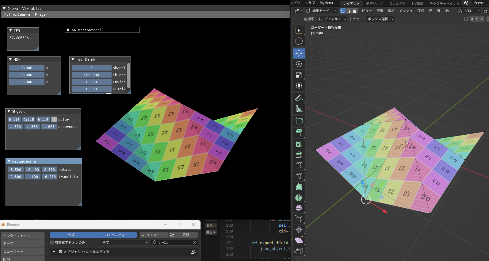
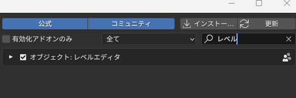
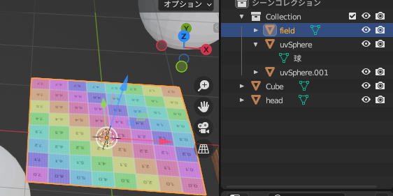

[](https://github.com/shimazaki-ryuta/GE3/actions/workflows/DebugBuild.yml)

[](https://github.com/shimazaki-ryuta/GE3/actions/workflows/ReleaseBuild.yml)

# MeshSync機能
## オブジェクト配置およびメッシュの同期機能。

* [該当コード](project/Engine/Scene/SceneLoader.cpp)
### アプリ側実行手順
1. - Resource/Model内に必要なモデルを追加(obj&mtl,gltf)
   - Resource内に必要な画像ファイルを追加
2. 以下コードを任意のSceneの所定の位置に追加
    - 任意Scene::Initialize内
        ```
        sceneLoader_.reset(new SceneLoader);
        sceneLoader_->LoadFile(読み込みシーン名);
        sceneLoader_->CreateModelList(空モデルリスト);
        
        sceneLoader_->CreateObjects(オブジェクトリスト);
        sceneLoader_->CreateTerrain(MeshSync適用オブジェクト);
        sceneLoader_->StartReceveJson();
        ```

    - 任意Scene::Update内
        ```
        sceneLoader_->CreateModelList(モデルリスト);
        sceneLoader_->ApplyTerrainTransform(MeshSync適用オブジェクト);
        sceneLoader_->ApplyRecevedData(オブジェクトリスト);
        sceneLoader_->ApplyTerrainVertices(MeshSync適用オブジェクト);
        ```
---

### Blender操作手順
1. [mesh_sync_to_engine.py](blenderaddon/mesh_sync_to_engine.py)をblenderのscripts/addons内に追加
2. 編集->プリファレンス->メッシュシンクを有効化

3. meshsyncさせたいオブジェクトのオブジェクト名を<span style="color: orange; ">field</span>に変更

